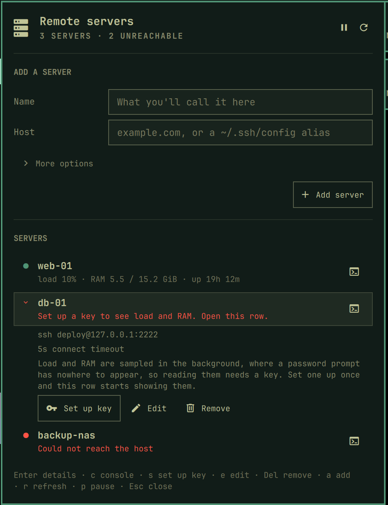

# Remote servers

**Everything you actually do to your own SSH boxes is one click away in the
bar, and nothing you don't.**

An [Omarchy](https://omarchy.org/) bar plugin for the servers you SSH into.
Keep a short list, open a console, and watch live load, RAM and uptime per
server. It tells you when one drops and when it comes back. No VPN client, no
RDP, no agent to install on the far end. One server icon, one popup, the ssh
commands you would otherwise be typing by hand.



## What it gives you

- **A list you keep, not a list something else discovers.** Add a server by
  name and host. Everything else (port, user, identity file, the timeout) is
  optional and defaults to whatever your own
  `~/.ssh/config` or ssh-agent already does for that host.
- **One button that makes a server work.** A server you have not set up
  key-based auth for says so, and **Set up key** generates a key if you have
  none, installs it, and checks a key-only login works. You type that
  account's password once, into `ssh-copy-id`'s own prompt. See
  [Set up key](#set-up-key).
- **Live load, RAM and uptime, sampled over ssh while the popup is open.**
  Load is normalized against the server's own core count, the same way this
  author's [Docker plugin](https://github.com/Majkelll/omarchy-docker)
  normalizes CPU against every core: a number that means "how loaded is this
  machine", not a raw figure that means nothing without knowing the core
  count.
- **A console, right on the row.** Connect opens a real, interactive ssh
  session in a terminal.
- **It tells you when a server drops, and when it comes back.** A desktop
  notification the first time a server stops answering, and another when it
  answers again. See [Notifications](#notifications).
- **A stop button.** One click stops every check, and the choice is
  remembered. See [Stopping the checks](#stopping-the-checks).
- **It knows the difference between your servers being gone and your network
  being gone.** With no connection the popup says so once, at the top, and
  stops reporting every server as unreachable. See
  [When the network is gone](#when-the-network-is-gone).
- **Never asks for, stores or forwards a password.** See
  [Privileges and security](#privileges-and-security), the part that actually
  matters.
- **Nothing else persisted.** The server list lives in one JSON file you can
  read, edit by hand, or put in your dotfiles. No history, no cached
  credentials, no state beyond the list itself.
- **Keyboard everything.** The popup never needs the mouse, form included.

## Install

```bash
omarchy plugin add https://github.com/Majkelll/omarchy-remote-servers.git --enable
```

Click the server icon in the bar and add your first server. There is nothing
to configure by hand first.

### Removing it

```bash
omarchy plugin remove io.github.majkelll.omarchy-remote-servers
```

That unloads the widget and deletes the plugin. Your server list is left
alone, in `~/.config/omarchy-remote-servers/servers.json`, so reinstalling
picks up where you left off. Delete that file yourself to remove it too.

## Adding a server

The popup opens with the add form on top:

```
ADD A SERVER

Name             [ web-01                                  ]
Host             [ web-01.internal                         ]
› More options
                                          [ + Add server ]
```

`Tab` walks the whole form, **More options** included, so a port and a user
never need the mouse. Name and host are the only two fields that matter for
most servers: leave the rest alone and the plugin runs plain `ssh host`,
exactly the way typing it yourself would, so anything already set up in
`~/.ssh/config` (a non-default user, a non-default port, a specific identity
file, a `ProxyJump`) keeps working unchanged.

**More options** opens the rest:

```
⌄ Fewer options

Port             [ 2222 ]
User             [ deploy                                  ]
Identity file    [ ssh-agent, or ~/.ssh/config             ]
Timeout          [ 5 ] seconds
```

| Field | Default | Meaning |
|---|---|---|
| Port | ssh's own default (22, or whatever `~/.ssh/config` says) | Only needed when it differs and isn't already in `~/.ssh/config`. |
| User | ssh's own default | Same. |
| Identity file | ssh's own default (ssh-agent, or `~/.ssh/config`) | The path to a **private SSH key**, not a password. Leave it empty unless you keep a specific key for this server, and use [Set up key](#set-up-key) to make one. |
| Timeout | 5 seconds | How long a connection attempt may take before giving up. |

## Set up key

**To see a server's load and RAM you have to set up a key for it once.** The
reading is sampled in the background, on a timer, with nothing on screen, so
it is forced non-interactive: a password prompt there would have nowhere to
appear and nothing to type into it. A server without key-based auth says so
on its own row instead:

```
SERVERS

● db-01                                               [>_]  [↻]
  Set up a key to see load and RAM. Open this row.
```

Open the row and the fix is right there. A server you just added opens by
itself, with that button already highlighted:

```
⌄ db-01                                               [>_]  [↻]
  Set up a key to see load and RAM. Open this row.

  ssh deploy@db-01.internal:2222
  5s connect timeout

  Load and RAM are sampled in the background, where a password
  prompt has nowhere to appear, so reading them needs a key.
  Set one up once and this row starts showing them.

  [ ⚿ Set up key ]   [ ✎ Edit ]   [ ⌫ Remove ]
```

**Set up key** (or `s`) opens a terminal and does three things:

1. If you have no SSH key yet, it makes one (`~/.ssh/id_ed25519`). An
   existing key is never overwritten.
2. It runs `ssh-copy-id`. **That account's password is asked for once,
   there, by `ssh-copy-id` itself.** This plugin never sees it, and nothing
   stores it.
3. It checks a key-only login actually works, with `IdentitiesOnly`, so what
   it confirms is the key it just copied rather than some other key already
   in your agent.

After that the row reads normally, and Connect never asks for anything again:

```
● db-01                                               [>_]  [↻]
  load 4% · RAM 6.1 / 15.5 GiB · up 12d 4h
```

Connect works without a key too. It opens a real terminal, so ssh asks for
the password there like it always would. It is only the background reading,
and the notifications that depend on it, that need one.

## The server list

Click the server icon to open the popup. Each row shows its name and, once a
reading exists, its load/RAM/uptime line. Two buttons sit on the row:

| | |
|---|---|
| **Console button** | Connect, an interactive ssh session in a terminal |
| **Click the row** | expand it |

### Expanded row

The exact ssh target, the identity file if one is set, the connect timeout,
and:

| Action | What |
|---|---|
| Set up key | Generates an SSH key if you have none and installs it on the server. See [Set up key](#set-up-key) |
| Edit | Reopens the form above, filled in, to change anything about the server |
| Remove | Takes it off this list. Nothing on the server itself is touched |

## Load, RAM and uptime

Sampled with one ssh call per server, run in parallel across every server on
the list. Ssh round trips are slow and network-bound in a way a local docker
call never is, so probing five servers one after another would mean waiting
out five timeouts in the worst case instead of one. The call pipes a small
POSIX `sh` script over stdin (`ssh ... 'sh -s' < probe.sh`) rather than
copying anything to the server first, so nothing is installed, uploaded or
left behind on the remote end. The whole reading comes straight out of
`/proc`, no sudo required.

Load is shown normalized against the server's own core count. `load 12%`
reads the same way this author's
[Docker plugin](https://github.com/Majkelll/omarchy-docker) reads total CPU:
"how loaded is this machine", not `uptime`'s raw 1-minute average, which
means nothing on its own without knowing how many cores it is out of.

Sampling only happens while the popup is open, on the interval set in the
widget's settings (20 seconds by default, higher than a local plugin's
default on purpose, since every sample is a network round trip rather than a
local call).

## Notifications

The first time a server stops answering, a desktop notification says so. When
it answers again, another says that. Nothing else is sent: a server that stays
down is reported once, not on every check.

A server's **first** reading is never a notification. Opening the popup on a
server that was already unreachable is not news about a change, and treating
it as one would mean an alert every time you opened the popup.

Two things silence them, because in both cases the plugin does not actually
know what the server is doing:

- while the checks are stopped, and
- while the machine itself has no connection, where every server would fail
  at once and none of those failures would be about the server.

Turn them off entirely with `notifyOnChange` in [Settings](#settings).

## Stopping the checks

The **pause button** next to Refresh stops every check, and `p` does the same
from the keyboard. The popup says so in a banner, the bar icon dims, and each
row reads "Checks paused" rather than showing a reading that is no longer
being taken.

The choice is written to `servers.json`, so it survives a restart of the shell
rather than quietly resuming behind your back. Press play to start again,
which also takes a fresh reading immediately.

## When the network is gone

Every server would fail at once, and "these servers are down" and "this
machine is not on the network" are different problems with different fixes.
So before touching any server, the plugin checks whether the machine can reach
the internet at all, the same host Omarchy's own network status probes and the
same way, so the two agree. With no connection the popup says it once at the
top and every row reads "No connection, checks paused" rather than each
claiming an outage of its own.

The probe can be wrong: a server on your LAN answers perfectly well with no
internet at all, and a captive portal answers everything. So a server that
*did* answer overrules the probe, and the offline banner never appears while
anything is still reachable. A probe that cannot run at all, with no `ping`
installed, reports `unknown` and is treated as online, because a probe that
could not run must never be the reason a real outage goes unreported.

## Keyboard

| Key | Does |
|---|---|
| `↑` `↓` / `j` `k` | move between servers |
| `Enter` | expand the selected server |
| `c` | open a console to it |
| `s` | set up key-based auth for it |
| `e` | edit it |
| `Delete` | remove it from the list |
| `a` | jump to the add-server form |
| `Tab` | walk the form, More options included |
| `r` | refresh load/RAM/uptime now |
| `p` | stop the checks, or start them again |
| `Esc` | back out one step: a confirmation, then an edit in progress, then More options, then the popup itself |

## Commands

```bash
omarchy-shell io.github.majkelll.omarchy-remote-servers toggle             # open or close the popup
omarchy-shell io.github.majkelll.omarchy-remote-servers list               # a one-line summary, e.g. "3 servers · 1 unreachable"
omarchy-shell io.github.majkelll.omarchy-remote-servers refresh            # resample load/RAM/uptime now
omarchy-shell io.github.majkelll.omarchy-remote-servers connect <name>     # opens a console to it
omarchy-shell io.github.majkelll.omarchy-remote-servers setupKey <name>    # generates/installs a key for it
omarchy-shell io.github.majkelll.omarchy-remote-servers pause              # stop every check
omarchy-shell io.github.majkelll.omarchy-remote-servers resume             # start them again
omarchy-shell io.github.majkelll.omarchy-remote-servers togglePaused       # either way
```

`<name>` matches either the server's display name or its internal id (shown
in `servers.json`).

In `~/.config/hypr/bindings.conf`:

```
bindd = SUPER SHIFT, S, Remote servers, exec, omarchy-shell io.github.majkelll.omarchy-remote-servers toggle
```

## Settings

Set this on the widget's entry in `~/.config/omarchy/shell.json`, or through
Setup > Plugins.

| Key | Default | Meaning |
|---|---|---|
| `statsRefreshSec` | `20` | Load/RAM/uptime refresh cadence while the popup is open. Not sampled at all while closed. |
| `notifyOnChange` | `true` | Send a desktop notification when a server drops or comes back. See [Notifications](#notifications). |

## Where things live

| Path | What |
|---|---|
| `~/.config/omarchy-remote-servers/servers.json` | the servers you've added, yours to edit |

```json
{
  "version": 1,
  "paused": false,
  "servers": [
    {
      "id": "prod-web",
      "name": "prod-web",
      "host": "prod.example.com",
      "port": 0,
      "user": "",
      "identityFile": "",
      "connectTimeoutSec": 5
    }
  ]
}
```

`paused` is the stop button, kept here so it survives a restart of the shell.

`port`, `user` and `identityFile` at `""`/`0` mean "let ssh decide": its own
default, or whatever `~/.ssh/config` already says for that host. A row
without a host is dropped rather than taking the plugin down with it, so a
hand-edited file that breaks stays contained to the row that broke.

## Privileges and security

This is the part that matters more than anything else above.

- **No password is ever stored, typed into or asked for by this plugin.**
  There is nowhere in `servers.json`, in the popup, or on the wire between
  this plugin and its helper scripts for one to go. Every field is public
  information about *how to reach* a server (a host, a port, a username, a
  path to a key file you already have), never a secret.
- **Three different trust models, used on purpose:**
  - **Connect** opens a real, interactive ssh session in a terminal. If a
    server still needs a password, that terminal is exactly where it belongs:
    typed directly into ssh's own prompt, never seen, captured or relayed by
    this plugin.
  - **Set up key** is the same thing for the one password you should ever
    have to type: `ssh-copy-id` asks for it, in that terminal, once. After
    that nothing needs it again.
  - **Sampling load/RAM/uptime** runs on a timer with nothing on screen, so
    it is forced non-interactive (`BatchMode=yes`,
    `NumberOfPasswordPrompts=0`). A server without key-based auth set up
    simply reports that it needs a key instead of ever waiting on, or being
    able to ask for, a password in the background.
- **Host keys are never auto-accepted.** Sampling runs with ssh's own default
  host-key checking, which combined with `BatchMode=yes` means a server ssh
  has never seen before fails closed rather than silently trusting it. The
  fix is the one ssh always offers: connect once with **Connect** or **Set up
  key**, in a real terminal, where ssh's own "are you sure you want to
  continue connecting?" prompt appears normally for you to actually check.
- **A saved field can never be read as an ssh flag, or as another field.**
  The target host is always passed after `--`, and any field starting with
  `-` (however it got there) is refused before it ever reaches ssh. Control
  characters are refused too, and stripped from anything saved: every field
  travels to the helper as one element of a `\x1f`-joined line, so a stray
  `\x1f` or newline in one field would otherwise become a field boundary in
  another. See `isPlausibleHost`, `isSafeOptionValue` and `clip` in
  `Model.js`.
- **Nothing is installed on the remote end.** The load/RAM/uptime probe is a
  small POSIX `sh` script piped over stdin (`ssh ... 'sh -s' < probe.sh`),
  read straight out of `/proc`. Never copied to disk on the server, never
  marked executable there, no sudo needed. **Set up key** appends one public
  key to `~/.ssh/authorized_keys` and nothing else.
- **Nothing is ever run on a server that you did not ask for.** The only
  thing this plugin sends unprompted is the read-only probe. There is no
  reboot, no shutdown and no remote command of any kind behind a button here:
  anything that changes a server happens in the console you opened yourself.
- **No sudo, no pkexec, no polkit, on this side.** Every ssh call is the
  plain `ssh` CLI, run as your user, using whatever access you already
  have.

## Layout

```
manifest.json                        plugin manifest (bar-widget, entry point, settings schema)
BarWidget.qml                        bar icon, owns the server list, its file, and every ssh action
Panel.qml                            the popup: the add/edit form and the server list
Model.js                             parsing, validation and formatting. No QML, no ssh calls
bin/omarchy-remote-servers-ctl       every ssh invocation, in one place
bin/omarchy-remote-servers-probe.sh  the read-only probe, piped into the remote shell over stdin
bin/omarchy-remote-servers-session   what runs inside a terminal: setting up a key
tests/model.test.js                  Model.js, under Node's own test runner
tests/ctl.test.sh                    the helper's arguments, wire format and bounds
```

`bin/omarchy-remote-servers-ctl` is a plain script and the place to look when
something misbehaves. Run it directly:

```bash
cd ~/.config/omarchy/plugins/io.github.majkelll.omarchy-remote-servers
enc=$(printf 'myid\x1fmyhost\x1f\x1f\x1f\x1f5')   # id, host, port, user, identity, timeout
./bin/omarchy-remote-servers-ctl stats-all ./bin/omarchy-remote-servers-probe.sh "$enc"
./bin/omarchy-remote-servers-ctl connect myhost "" "" "" 5
```

Fields are joined by `\x1f` (unit separator), never a space or tab. See the
script's own header comment for the exact layout of each subcommand.

## Development

```bash
ln -s "$PWD" ~/.config/omarchy/plugins/io.github.majkelll.omarchy-remote-servers
omarchy-shell shell rescanPlugins
omarchy plugin enable io.github.majkelll.omarchy-remote-servers right
```

Saving a file under `~/.config/omarchy/plugins/` usually reloads the plugin
automatically. If an edit doesn't show up, Quickshell's QML engine can keep
serving an already-compiled version of a file from memory. Run
`omarchy restart shell`, which also clears the on-disk QML cache.

The parsing, validation and formatting live in `Model.js`, free of Qt, so
they run under Node:

```bash
node tests/model.test.js   # the model
bash tests/ctl.test.sh     # the helper
```

`.github/workflows/tests.yml` runs both on every push, plus the helper
scripts against a real, throwaway sshd: `stats-all` (a reachable and an
unreachable host, in parallel, plus its connectivity verdict), a host key that
isn't trusted yet, `connect`, and `setup-key` generating and installing a key
for real.

## License

MIT. See [LICENSE](LICENSE).
